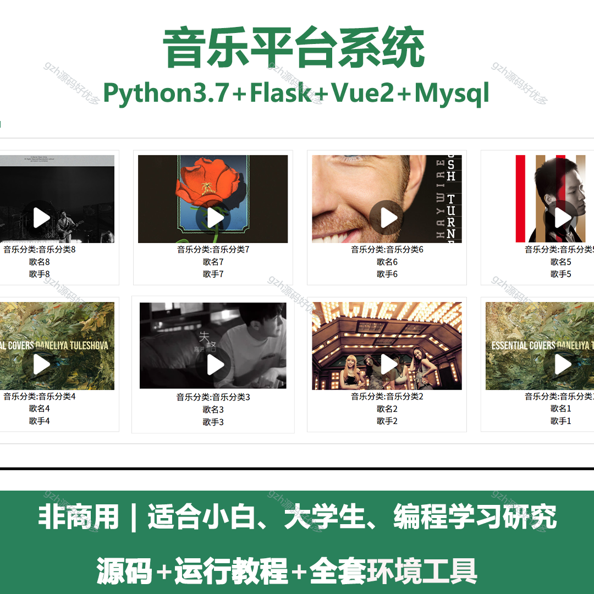
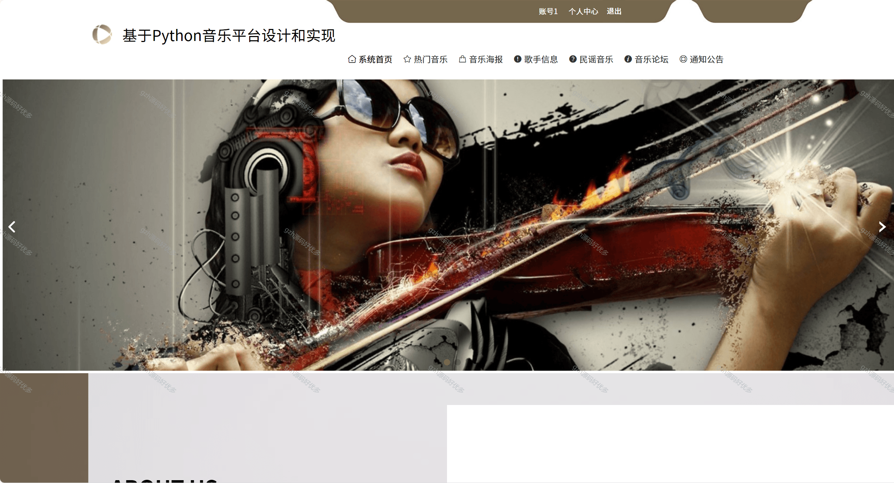
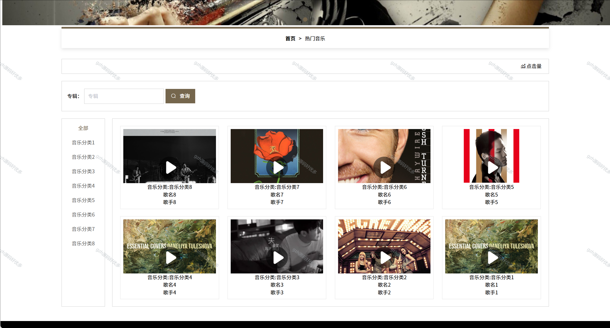
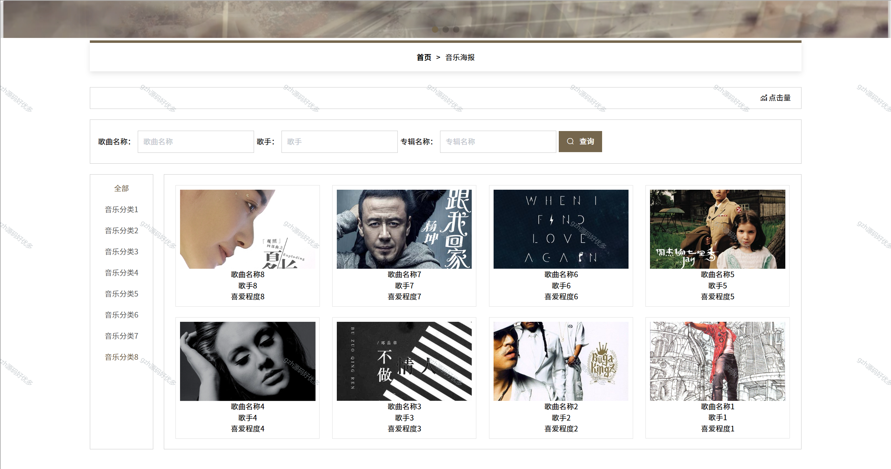
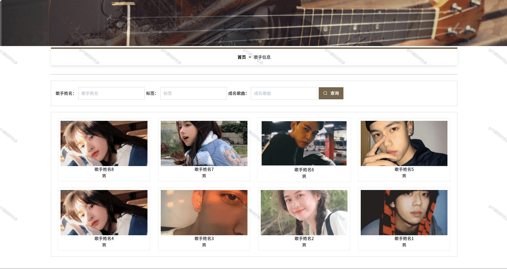
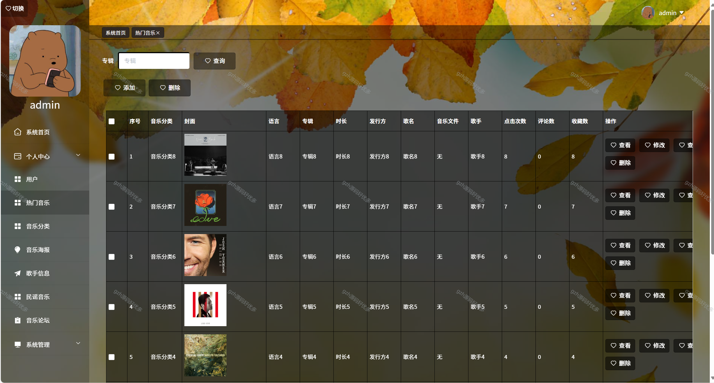
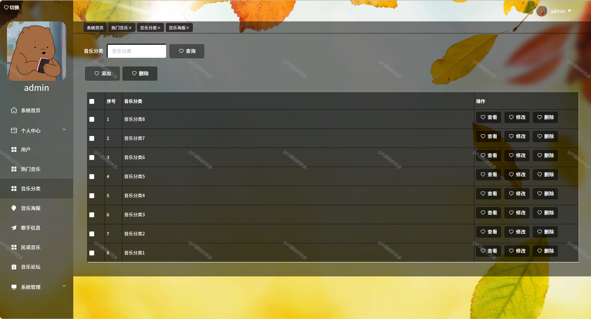
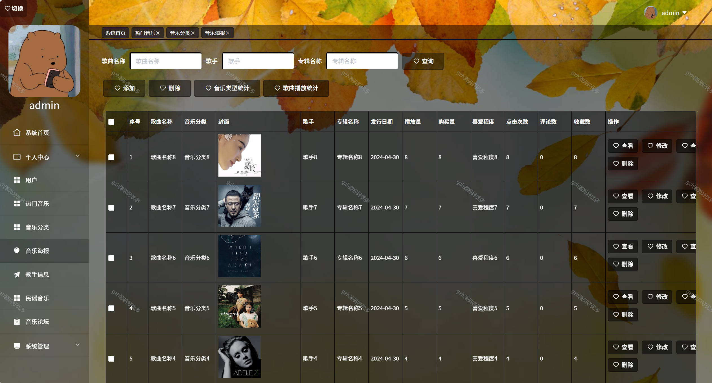
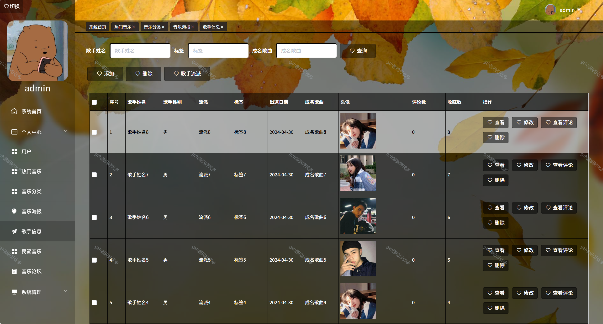

# python058
python058基于Python+Flask的音乐平台系统
 
## 查看主页获取源码

### 一、关键词
音乐平台系统，在线音乐平台系统，音乐服务平台系统

### 二、作品包含
源码+数据库+全套环境和工具资源+本地部署教程

### 三、项目技术
前端技术：Vue2.0、Element-ui
后端技术：Python3.7、Flask

### 四、运行环境（以下版本亲测，其他版本未知，请自测）
开发工具：PyCharm + VSCODE

数据库：MySQL5.7（最低要5.7版本）

数据库管理工具：Navicat10+

Python：Python3.7

前端Nodejs：14

浏览器：谷歌浏览器

### 五、项目介绍
项目编号：python058

音乐平台系统用于整合音乐资源，为用户提供音乐播放、搜索、推荐、社交互动及创作者管理等一站式服务。
该音乐平台系统具备前台用户浏览（音乐、海报、歌手信息浏览，论坛互动 ）与后台管理（音乐、分类、海报、歌手数据增删改查及统计 ）功能，支持用户与管理员不同操作场景。

### 六、运行截图

